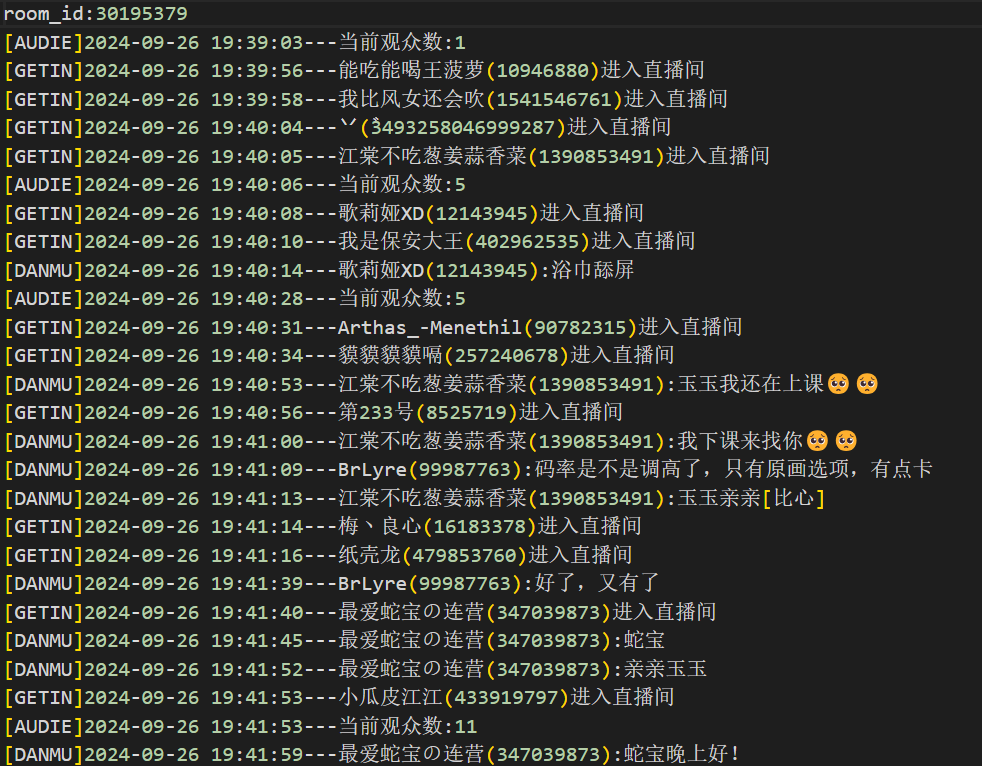
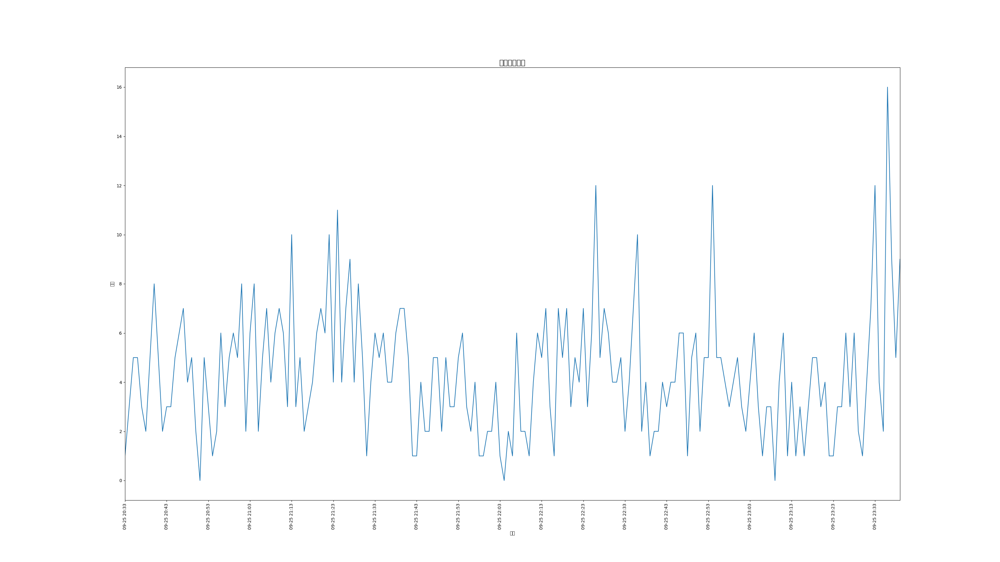
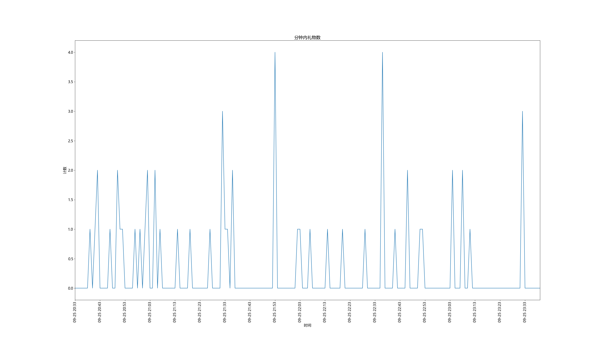
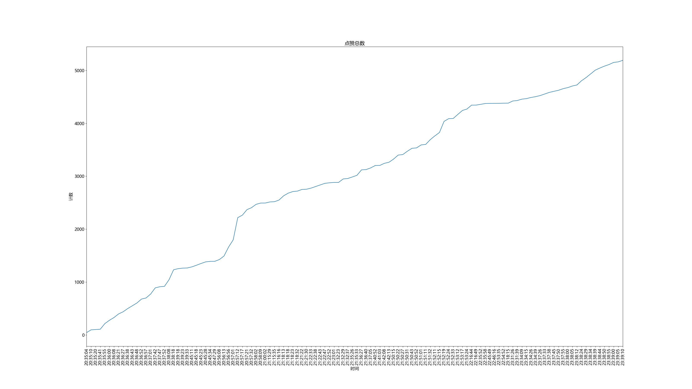
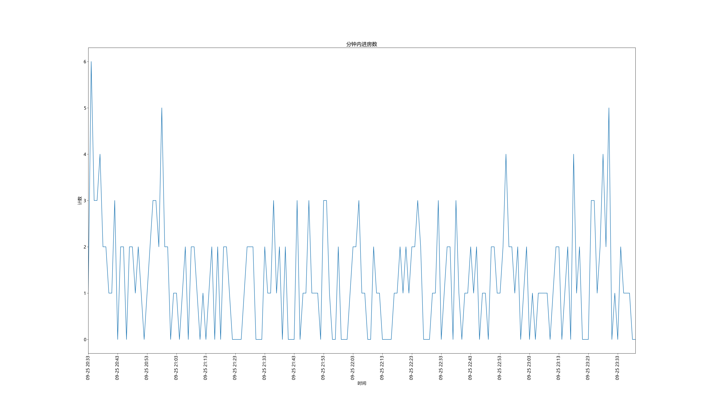
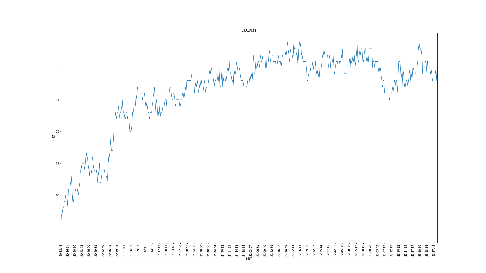

<h1>📺BILI-LIVE-LOGGER✍️</h1>
<h2>✨一款快速记录b站直播信息日志的工具，快捷，自动，易用！</h2>
<h3 style="line-height: normal">🔴BILI-LIVE-LOGGER是一款基于Python编写的脚本，可以用于追踪指定B站主播单场次直播获得的<b>弹幕数、礼物数、涨粉数、进房数、同接数等等</b>数据，并生成易于阅读的格式化的log文件。当然，更为重量级的是，生成的log文件可以通过该项目自带的另一个脚本<b>绘制出折线图！</b>大大方便主播/运营了解自己本场次直播特定时段的<b>观众反响!</b>
亦可用于房管对违规用户进行追杀(?)</h3>

<h2>快速访问：</h2>
<ul>

  [项目特点](#xmtd) 
  [项目效果展示](#xgzs) 
  [使用指南](#syzn) 
  [注意事项](#zysx) 
  [更新日志](#gxrz)

</ul>

<xmtd>
<h2><a name="xmtd" id="xmtd">项目特点：</a></h2>
<ul>
  <li>🤳账号登录仅需扫一扫二维码</li>
  <li>📝自动记录弹幕数、礼物数、涨粉数、进房数、同接数等数据</li>
  <li>📝自动检测直播间状态，开播即检测，关播即停止</li>
  <li>📝自动生成格式化的log文件</li>
  <li>📈可手动选择生成折线图</li>
</ul>

<xgzs>
<h2><a id="xgzs" name="xgzs">项目效果展示：</a></h2>
<h3><b>📝📝📝日志：</b></h3>

<h3><b>📈📈📈折线图：</b></h3>

📈弹幕数折线图：

📈礼物数折线图：

📈点赞数折线图：

📈进房数折线图：

📈同接数折线图：

<syzn>
<h2><a id="syzn" name="syzn">使用指南：</a></h2>
<h3>⚒️环境配置：</h3>

<b>Step.1</b>

安装Python3.8及以上版本

<b>Step.2</b>

安装依赖库，建议搭配环境管理插件使用(例如：virtualenv,anaconda)

在项目根目录下打开命令行，输入以下命令：

<pre><code>pip install -r requirements.txt</code></pre>
<h3 style="color: aqua">⚠️注意，此步及其重要↓↓↓</h3>

<b>然后使用编辑器打开根目录下的'main.py'编辑文件开头处 "##################################请配置#####################################" 位置下的roomid为bilibili主播的直播间房间号(int)</b>

<h3>🔑登录：</h3>
<h4 style="color: red">注意：仅第一次开启需要登录！</h4>

在项目根目录下打开命令行，输入以下命令：

<pre><code>python main.py</code></pre>

对于windows用户：

此时会显示出一张二维码，打开<b style="color: pink">bilibili手机端</b>扫码进行登录，之后程序将会自动开始开播检测/记录

对于linux用户：

此时项目根目录会出现一张名为'qrcode.png'的图片，打开该图片后，打开<b style="color: pink">bilibili手机端</b>扫码进行登录，之后程序将会自动开始开播检测/记录

<h3>📝使用：</h3>

在项目根目录下打开命令行，输入以下命令：

<pre><code>python main.py</code></pre>

此时程序将会自动开始开播检测/记录

<h3>📈绘制折线图：</h3>

在记录结束后，于项目根目录下打开命令行，输入以下命令：

<pre><code>python Graphic/PLOT.py</code></pre>

此时程序将会自动以最新的log文件为模版绘制折线图，并保存在Graphic文件夹下对应时间的文件夹中！

<zysx>
<h2><a name="zysx" id="zysx">注意事项：</a></h2>
<ul>
  <li>请勿将本脚本用于非法用途！</li>
  <li>请勿将本脚本用于商业用途！</li>
  <li>本程序对于用户登录信息的存储目前虽存储在本地，但是尚处于不怎么安全的状态(之后会优化的！)，因此建议使用者使用<b>bilibili小号</b>来登录此脚本</li>
  <li style="color: red;"><b>在使用过该项目后，在将该项目由本地传播到其他设备上时，请务必将根目录下的loginfo.dat删除！！！</b></li>
</ul>

<gxrz>
<h2><a name="gxrz" id="gxrz">更新日志：</a></h2>
<ul>
  <li>2024.09.26</li>
  <ul>
    <li>上传该项目第一个版本</li>
  </ul>
</ul>